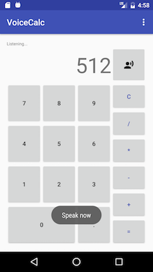

# VoiceCalc

- https://github.com/ginpei/VoiceCalc

## Feature

- Basic calculation
- Voice input

## What I did

- Voice recognition using [SpeechRecognizer](https://developer.android.com/reference/android/speech/SpeechRecognizer.html)
- Support both portrait and landscape display
- Independent and reusable calculation module ([`Calculator` class](/app/src/main/java/info/ginpei/voicecalc/Calculator.java))
    - With [tests](/app/src/test/java/info/ginpei/voicecalc/CalculatorTest.java)
